# Overflow - BTC Price Prediction Game

Overflow is a decentralized real-time BTC price prediction game built on **Sui**. Real-time prediction needs both strong security (for deposits and withdrawals) and low latency (for rounds and UX)—requirements that many chains struggle to meet. Sui’s performance, security, and composability make it a strong fit. Overflow delivers a DeFi experience built for real-world scale: fast, secure prediction rounds with a hybrid architecture that keeps funds on-chain while keeping the game responsive.

Users deposit USDC to their house balance and place bets on Bitcoin price movements within 30-second rounds. The system uses on-chain treasury management (Move smart contracts) with off-chain game logic to maximize security where it matters (deposits/withdrawals) and performance where it counts (instant bets and settlements). The result is a working prototype that demonstrates a clear use case for Sui: real-time, composable DeFi with a focus on user experience and technical execution.

## Core Features

- **Real-time BTC price prediction** — 30-second rounds with live price feed and countdown
- **USDC-based betting on Sui** — Deposits and withdrawals secured by Move smart contracts; bets use house balance for instant placement
- **On-chain treasury** — Secure deposit/withdrawal with event-driven balance sync and full audit trail
- **Off-chain game layer** — Fast bet placement and settlement without per-bet gas or wallet prompts
- **Live price chart** — Historical data and round-by-round visualization
- **Multiple betting targets** — Configurable multipliers and clear payoff structure
- **Audit logging** — Every balance change logged for transparency and reconciliation
- **Event-driven architecture** — Blockchain events drive balance updates for correctness and composability

## Why Sui

Overflow is designed to leverage Sui’s strengths as a DeFi foundation:

- **Security** — Move’s resource model and type system keep treasury logic safe; coins and events are first-class, reducing trust assumptions.
- **Performance** — Sui’s throughput and low latency support real-time rounds and event processing without slowing down the game.
- **Composability** — Shared treasury object, standard Coin usage, and event emission make the app composable with other Sui DeFi primitives and future upgrades (e.g. PTBs, order books).
- **Real-world scale** — The hybrid on-chain/off-chain design shows how to build a responsive, gas-efficient experience that can scale to many users and rounds.

The project includes a **working prototype** with wallet connect, deposit/withdraw, live rounds, and payouts—suitable for demos and further iteration within the Sui ecosystem.

## System Architecture

The application follows a hybrid architecture combining on-chain treasury operations with off-chain game logic. This design optimizes for security (deposits/withdrawals on-chain) and performance (game logic off-chain).

### High-Level Architecture

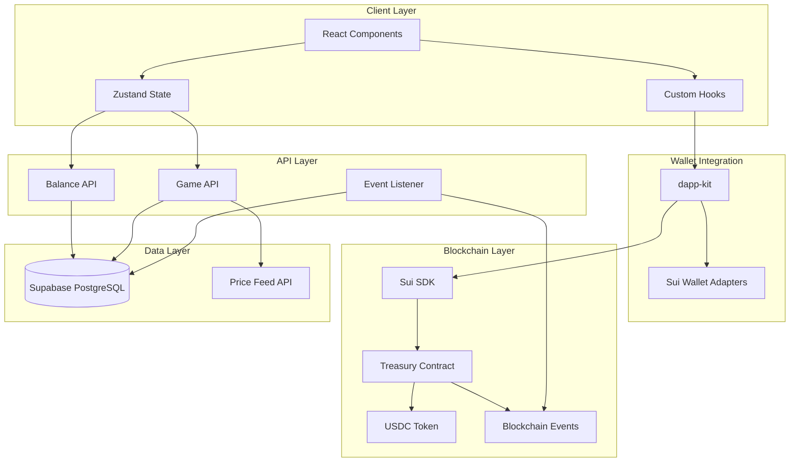

### Component Architecture

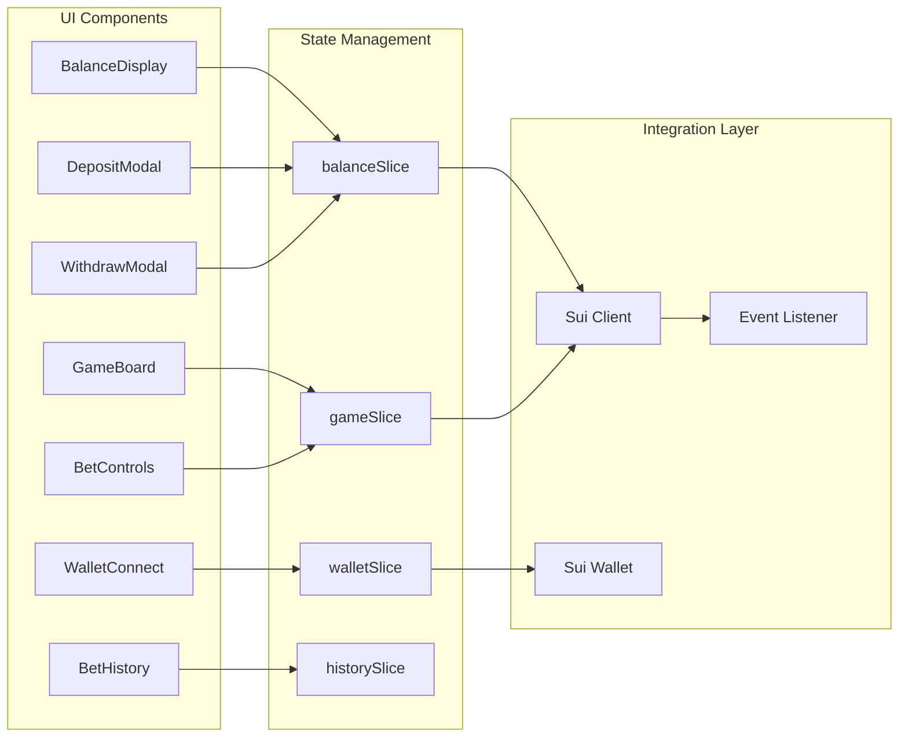

### Data Flow Diagrams

#### Deposit Flow

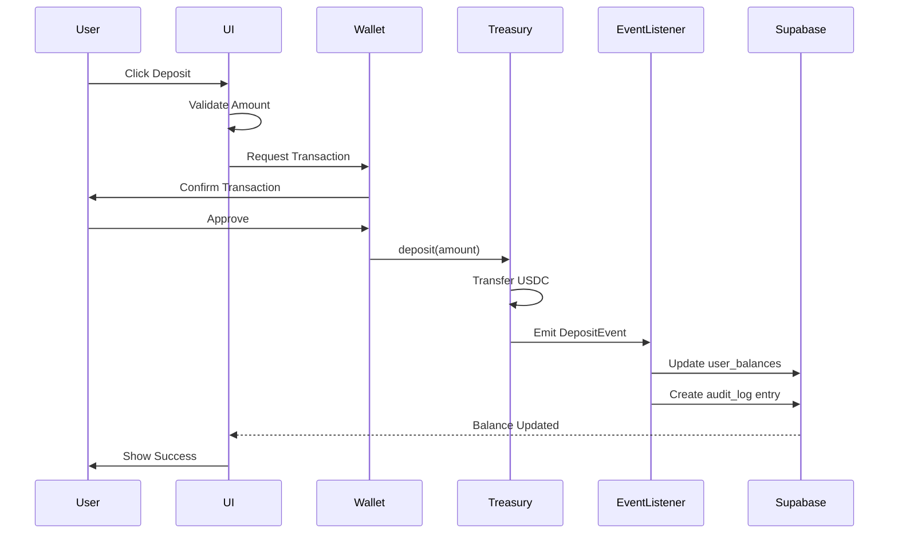

#### Withdrawal Flow

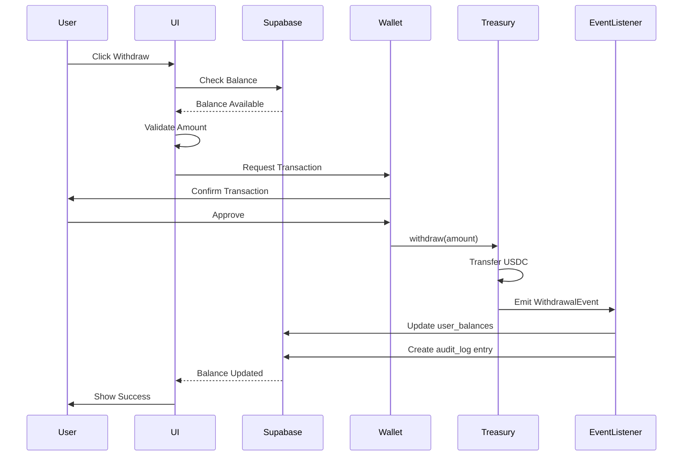

#### Bet Placement Flow

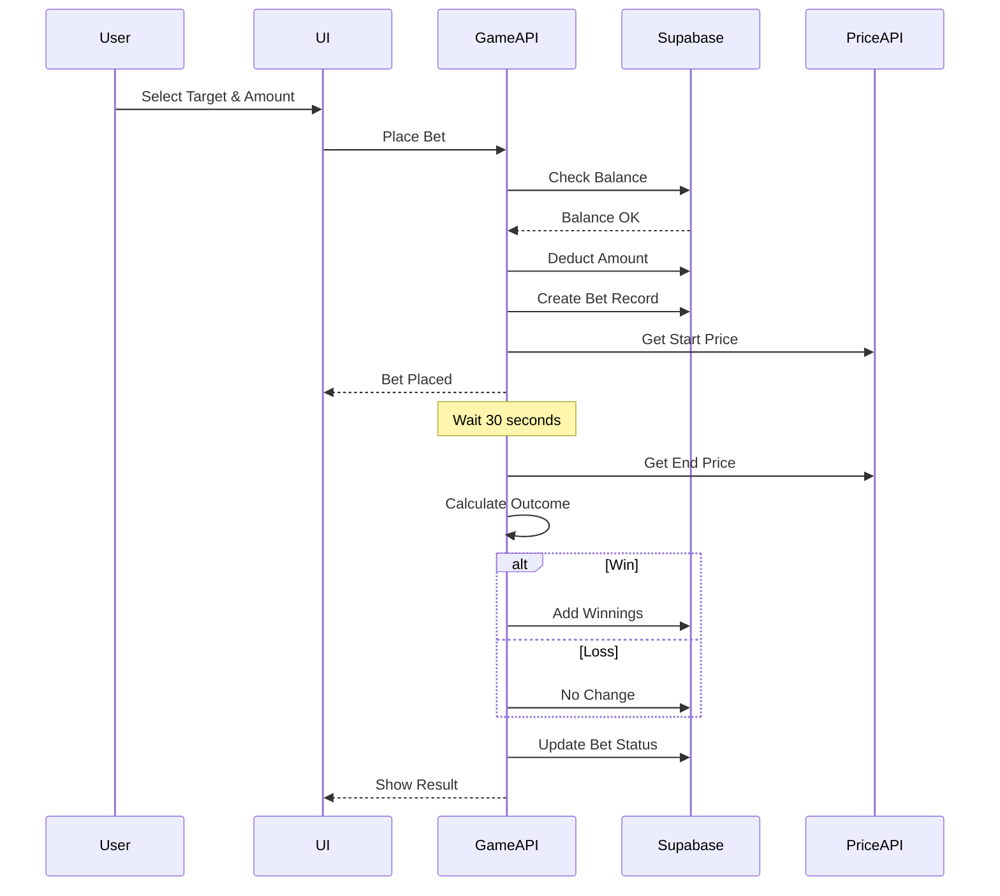

## Technical Stack

| Area | Technologies |
|------|--------------|
| **Frontend** | Next.js 16, React 19, TypeScript, Tailwind CSS 4, Zustand (state), Recharts (charts), TanStack React Query (used by dapp-kit) |
| **Blockchain** | Sui: `@mysten/dapp-kit` (wallet connect, UI), `@mysten/sui` (client, transactions); Move for treasury contract |
| **Prices** | **Pyth Network** (`@pythnetwork/hermes-client`) for BTC/SUI/SOL; mock feed in same file for fallback |
| **Backend / DB** | Next.js API routes (serverless), **Supabase** (PostgreSQL + `@supabase/supabase-js`) for balances, audit log, stored procedures |
| **Charts / UX** | Recharts, d3-scale / d3-shape, custom LiveChart with asset switcher (BTC/SUI/SOL) |
| **Dev / test** | Jest, Testing Library, fast-check, ESLint, Supabase CLI, ts-node for scripts |

### Frontend
- **Next.js 14**: React framework with App Router for server-side rendering
- **TypeScript**: Type-safe development with strict mode enabled
- **Tailwind CSS**: Utility-first CSS framework for responsive design
- **Zustand**: Lightweight state management with minimal boilerplate
- **Recharts**: Composable charting library for price visualization
- **@mysten/dapp-kit**: Official Sui wallet integration with React hooks

### Blockchain (Sui)
- **Sui** — Layer 1 with object-centric model, high throughput, and Move for secure DeFi
- **Sui Move** — Treasury contract with events and Coin standard for composability
- **@mysten/sui.js** — TypeScript SDK for client and transaction building
- **USDC on Sui** — Stablecoin for deposits and betting

### Backend
- **Next.js API Routes**: Serverless API endpoints for game logic
- **Supabase**: PostgreSQL database with real-time subscriptions
- **Node.js**: Runtime environment for event listener service

### Development
- **Jest**: Testing framework with coverage reporting
- **@testing-library/react**: Component testing utilities
- **fast-check**: Property-based testing library
- **ESLint**: Code linting with Next.js configuration
- **TypeScript Compiler**: Type checking and compilation

## Prerequisites

- Node.js 18+ and npm
- A Sui wallet (Sui Wallet, Suiet, Ethos, etc.) for testing
- Sui testnet SUI tokens for gas (get from [Sui Testnet Faucet](https://discord.com/channels/916379725201563759/971488439931392130))
- Sui testnet USDC tokens for gameplay

## Getting Started

### 1. Install Dependencies

```bash
npm install
```

### 2. Set Up Environment Variables

Copy the example environment file and configure it:

```bash
cp .env.example .env
```

Edit `.env` to configure your settings. The default values point to the deployed testnet contracts.

**Required Environment Variables:**
- `NEXT_PUBLIC_SUI_NETWORK`: Network to use (testnet, mainnet, devnet)
- `NEXT_PUBLIC_SUI_RPC_ENDPOINT`: Sui RPC endpoint URL
- `NEXT_PUBLIC_TREASURY_PACKAGE_ID`: Deployed treasury contract package ID
- `NEXT_PUBLIC_TREASURY_OBJECT_ID`: Treasury shared object ID
- `NEXT_PUBLIC_USDC_TYPE`: USDC token type on Sui
- `NEXT_PUBLIC_SUPABASE_URL`: Your Supabase project URL
- `NEXT_PUBLIC_SUPABASE_ANON_KEY`: Your Supabase anonymous key

### 3. Set Up Supabase Database

The application uses Supabase for off-chain data storage. You need to:

1. Create a new Supabase project at [supabase.com](https://supabase.com)
2. Install Supabase CLI: `npm install -g supabase`
3. Link to your project: `supabase link --project-ref your-project-ref`
4. Push the database schema: `supabase db push`
5. Update `.env` with your Supabase URL and anon key

### 4. Start the Development Server

```bash
npm run dev
```

Open [http://localhost:3000](http://localhost:3000) in your browser.

### 5. Connect Your Sui Wallet

1. Install a Sui wallet extension (Sui Wallet, Suiet, or Ethos)
2. Create or import a wallet
3. Switch to Sui testnet
4. Get testnet SUI from the [faucet](https://discord.com/channels/916379725201563759/971488439931392130)
5. Click "Connect Sui Wallet" in the app

### 6. Get Testnet USDC

To play the game, you need testnet USDC tokens. You can:
- Use the Sui testnet faucet to get test USDC
- Or contact the project maintainers for testnet USDC

## Project Structure

```
overflow/
├── app/                          # Next.js App Router
│   ├── api/                      # API Routes
│   │   └── balance/              # Balance management endpoints
│   │       ├── deposit/          # Deposit endpoint
│   │       ├── withdraw/         # Withdrawal endpoint
│   │       ├── bet/              # Bet placement endpoint
│   │       ├── win/              # Win payout endpoint
│   │       ├── events/           # Event listener endpoint
│   │       └── [address]/        # Balance query endpoint
│   ├── layout.tsx                # Root layout with providers
│   ├── page.tsx                  # Main game page
│   ├── providers.tsx             # Client-side providers
│   └── globals.css               # Global styles
│
├── components/                   # React Components
│   ├── wallet/                   # Wallet integration
│   │   ├── WalletConnect.tsx     # Wallet connection button
│   │   └── WalletInfo.tsx        # Wallet information display
│   ├── balance/                  # Balance management
│   │   ├── BalanceDisplay.tsx    # Balance display component
│   │   ├── DepositModal.tsx      # Deposit modal
│   │   └── WithdrawModal.tsx     # Withdrawal modal
│   ├── game/                     # Game components
│   │   ├── GameBoard.tsx         # Main game board
│   │   ├── BetControls.tsx       # Bet placement controls
│   │   ├── TargetGrid.tsx        # Betting targets grid
│   │   ├── LiveChart.tsx         # Price chart
│   │   ├── RoundTimer.tsx        # Round countdown timer
│   │   └── ActiveRound.tsx       # Active round display
│   ├── history/                  # Bet history
│   │   ├── BetHistory.tsx        # Bet history list
│   │   └── BetCard.tsx           # Individual bet card
│   └── ui/                       # Reusable UI components
│       ├── Button.tsx            # Button component
│       ├── Card.tsx              # Card component
│       ├── Modal.tsx             # Modal component
│       ├── Toast.tsx             # Toast notification
│       └── LoadingSpinner.tsx    # Loading indicator
│
├── lib/                          # Core Libraries
│   ├── sui/                      # Sui blockchain integration
│   │   ├── client.ts             # Sui client configuration
│   │   ├── config.ts             # Network configuration
│   │   ├── wallet.ts             # Wallet integration
│   │   └── event-listener.ts     # Event listener service
│   ├── store/                    # State management (Zustand)
│   │   ├── index.ts              # Store configuration
│   │   ├── walletSlice.ts        # Wallet state
│   │   ├── balanceSlice.ts       # Balance state
│   │   ├── gameSlice.ts          # Game state
│   │   └── historySlice.ts       # Bet history state
│   ├── balance/                  # Balance management
│   │   └── synchronization.ts    # Balance sync logic
│   ├── supabase/                 # Supabase client
│   │   └── client.ts             # Supabase configuration
│   ├── utils/                    # Utility functions
│   │   ├── constants.ts          # Application constants
│   │   ├── formatters.ts         # Data formatters
│   │   ├── errors.ts             # Error handling
│   │   └── priceFeed.ts          # Price feed integration
│   └── logging/                  # Logging utilities
│       └── error-logger.ts       # Error logging
│
├── sui-contracts/                # Sui Move Smart Contracts
│   ├── sources/                  # Contract source files
│   │   └── treasury.move         # Treasury contract
│   ├── build/                    # Compiled contracts
│   ├── Move.toml                 # Move package manifest
│   └── Move.lock                 # Move dependencies lock
│
├── supabase/                     # Supabase Configuration
│   ├── migrations/               # Database migrations
│   │   ├── 001_create_user_balances.sql
│   │   ├── 002_create_balance_audit_log.sql
│   │   ├── 003_create_balance_procedures.sql
│   │   └── 004_create_reconciliation_procedure.sql
│   ├── scripts/                  # Database scripts
│   │   ├── verify-setup.ts       # Verify database setup
│   │   └── apply-migration.ts    # Apply migrations
│   └── __tests__/                # Database tests
│       ├── user_balances.test.ts
│       ├── balance_audit_log.test.ts
│       └── balance_procedures.test.ts
│
├── types/                        # TypeScript Type Definitions
│   ├── sui.ts                    # Sui-specific types
│   ├── game.ts                   # Game-related types
│   ├── bet.ts                    # Bet-related types
│   └── flow.ts                   # Legacy Flow types
│
├── scripts/                      # Utility Scripts
│   └── verify-deposit-withdrawal.ts  # Test deposit/withdrawal
│
├── .kiro/                        # Kiro IDE Configuration
│   └── specs/                    # Project specifications
│       └── sui-migration/        # Migration documentation
│
├── .env                          # Environment variables
├── .env.example                  # Environment template
├── package.json                  # NPM dependencies
├── tsconfig.json                 # TypeScript configuration
├── tailwind.config.js            # Tailwind CSS configuration
├── next.config.ts                # Next.js configuration
├── jest.config.js                # Jest configuration
└── README.md                     # This file
```

## Database Schema

### Entity Relationship Diagram

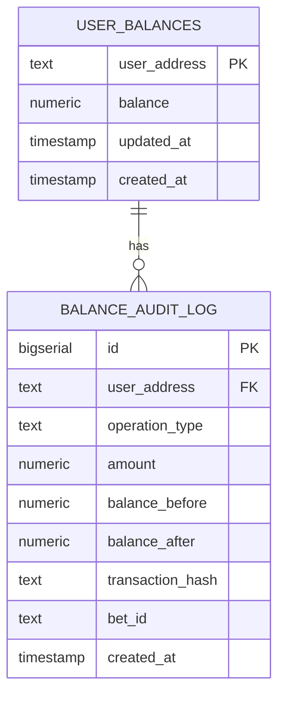

### Table Definitions

#### user_balances

Stores the current house balance for each user address.

| Column | Type | Constraints | Description |
|--------|------|-------------|-------------|
| user_address | TEXT | PRIMARY KEY | Sui wallet address |
| balance | NUMERIC(20,8) | NOT NULL, >= 0 | Current USDC balance |
| updated_at | TIMESTAMP | DEFAULT NOW() | Last update timestamp |
| created_at | TIMESTAMP | DEFAULT NOW() | Account creation timestamp |

#### balance_audit_log

Comprehensive audit trail for all balance operations.

| Column | Type | Constraints | Description |
|--------|------|-------------|-------------|
| id | BIGSERIAL | PRIMARY KEY | Auto-incrementing ID |
| user_address | TEXT | NOT NULL | Sui wallet address |
| operation_type | TEXT | NOT NULL | Operation type (deposit, withdrawal, bet_placed, bet_won, bet_lost) |
| amount | NUMERIC(20,8) | NOT NULL | Operation amount |
| balance_before | NUMERIC(20,8) | NOT NULL | Balance before operation |
| balance_after | NUMERIC(20,8) | NOT NULL | Balance after operation |
| transaction_hash | TEXT | NULL | Blockchain transaction hash |
| bet_id | TEXT | NULL | Associated bet ID |
| created_at | TIMESTAMP | DEFAULT NOW() | Operation timestamp |

### Stored Procedures

Balance updates use dedicated procedures that atomically update `user_balances` and insert into `balance_audit_log`:

- **deduct_balance_for_bet**(p_user_address, p_bet_amount) — Deducts balance for a bet; inserts audit row with `operation_type = 'bet_placed'`. Used by the bet API.
- **credit_balance_for_payout**(p_user_address, p_payout_amount, p_bet_id) — Credits winnings; audit `operation_type = 'bet_won'`.
- **update_balance_for_deposit**(p_user_address, p_amount, p_transaction_hash) — Credits balance and logs deposit. Used by the deposit API endpoint.
- **update_balance_for_withdrawal**(p_user_address, p_amount, p_transaction_hash) — Debits balance and logs withdrawal. Used by the withdraw API endpoint.

The Sui event listener (when it processes DepositEvent/WithdrawalEvent) updates `user_balances` and `balance_audit_log` directly. All operations are audited.

#### reconcile_balance

Reconciles user balance with blockchain state.

```sql
CREATE OR REPLACE FUNCTION reconcile_balance(
    p_user_address TEXT,
    p_expected_balance NUMERIC
) RETURNS TABLE(
    discrepancy NUMERIC,
    current_balance NUMERIC,
    expected_balance NUMERIC
)
```

## Smart Contract Architecture

### Treasury Contract

The treasury contract manages USDC deposits and withdrawals using Sui Move.

#### Contract Structure

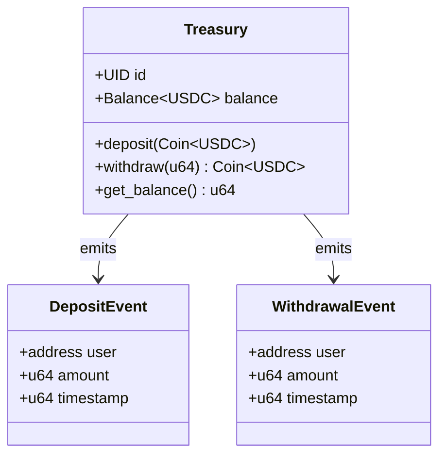

#### Key Functions

**deposit**
```move
public entry fun deposit<T>(
    treasury: &mut Treasury<T>,
    payment: Coin<T>,
    ctx: &mut TxContext
)
```
Deposits USDC tokens into the treasury and emits a DepositEvent.

**withdraw**
```move
public entry fun withdraw<T>(
    treasury: &mut Treasury<T>,
    amount: u64,
    ctx: &mut TxContext
): Coin<T>
```
Withdraws USDC tokens from the treasury and emits a WithdrawalEvent.

**get_balance**
```move
public fun get_balance<T>(treasury: &Treasury<T>): u64
```
Returns the current USDC balance in the treasury.

#### Event Structures

**DepositEvent**
```move
struct DepositEvent has copy, drop {
    user: address,
    amount: u64,
    timestamp: u64
}
```

**WithdrawalEvent**
```move
struct WithdrawalEvent has copy, drop {
    user: address,
    amount: u64,
    timestamp: u64
}
```

### Contract Deployment Process

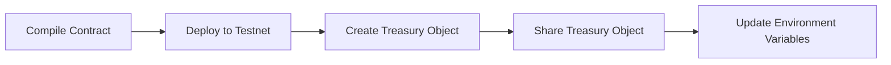

## Game Mechanics

### Round System

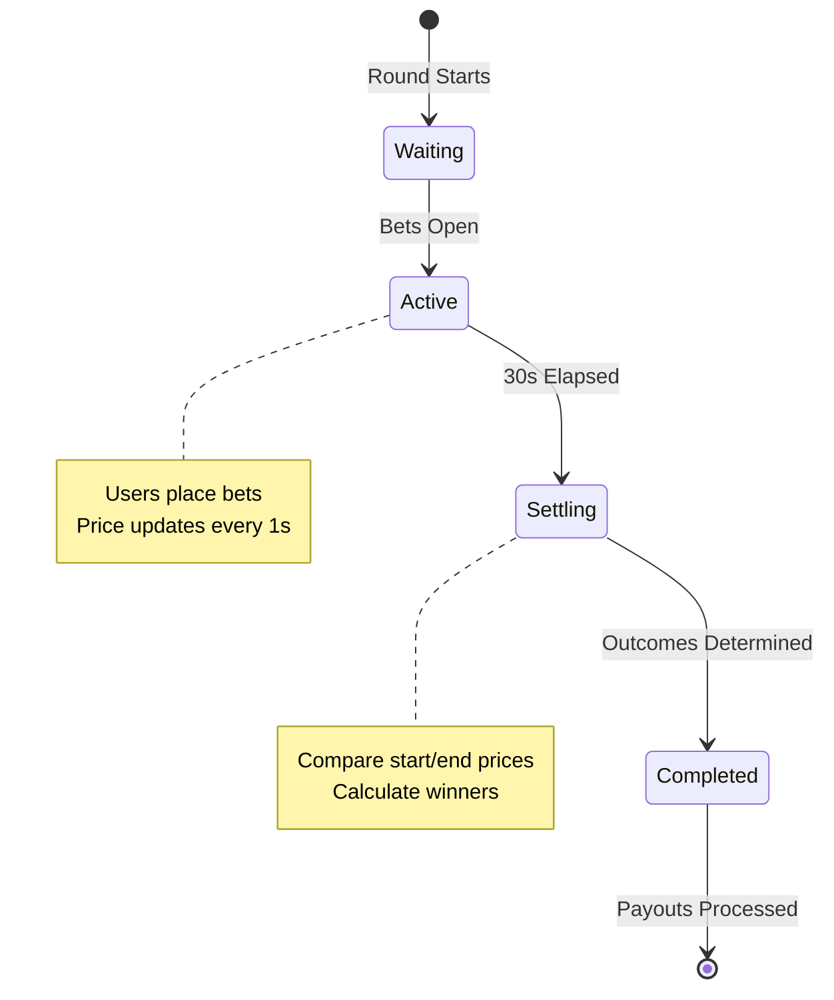

### Betting Targets

The game offers multiple betting targets based on BTC price move (in USD) over the 30-second round, with configurable multipliers:

| Target | Label | Price Move | Multiplier |
|--------|--------|------------|------------|
| 1 | +$5 in 30s | +$5 | 1.5x |
| 2 | +$10 in 30s | +$10 | 2.0x |
| 3 | +$20 in 30s | +$20 | 3.0x |
| 4 | +$50 in 30s | +$50 | 5.0x |
| 5 | +$100 in 30s | +$100 | 10.0x |
| 6 | -$5 in 30s | -$5 | 1.5x |
| 7 | -$10 in 30s | -$10 | 2.0x |
| 8 | -$20 in 30s | -$20 | 3.0x |

### Payout Calculation

```
Payout = Bet Amount × Multiplier (if target hit)
Payout = 0 (if target missed)
```

### House Balance System

The house balance system enables fast bet placement without blockchain transactions:

1. User deposits USDC to treasury (on-chain)
2. Event listener credits house balance (off-chain)
3. User places bets using house balance (off-chain)
4. Winnings credited to house balance (off-chain)
5. User withdraws to wallet (on-chain)

**Design rationale:** This hybrid approach optimizes for three goals that Sui is well-suited to support:
- **Security** — Deposits and withdrawals are on-chain; Move and the Coin standard ensure correct handling of funds.
- **Performance** — Rounds and bets run off-chain so the game stays fast and scalable without per-bet gas.
- **User experience** — One-click bets and instant feedback; users sign only for deposit/withdraw.

## Testing

### Run Frontend Tests

```bash
npm test
```

### Run Tests with Coverage

```bash
npm run test:coverage
```

### Test Deposit and Withdrawal

```bash
npm run verify-deposit-withdrawal
```

## Network Configuration

The application supports multiple Sui networks. Configure via `NEXT_PUBLIC_SUI_NETWORK` environment variable.

| Network | Description | RPC Endpoint |
|---------|-------------|--------------|
| testnet | Sui testnet (default) | https://fullnode.testnet.sui.io:443 |
| mainnet | Sui mainnet | https://fullnode.mainnet.sui.io:443 |
| devnet | Sui devnet | https://fullnode.devnet.sui.io:443 |
| localnet | Local Sui node | http://localhost:9000 |

## Environment Variables

### Required Variables

| Variable | Description | Example |
|----------|-------------|---------|
| `NEXT_PUBLIC_SUI_NETWORK` | Sui network to connect to | `testnet` |
| `NEXT_PUBLIC_SUI_RPC_ENDPOINT` | Sui RPC endpoint URL | `https://fullnode.testnet.sui.io:443` |
| `NEXT_PUBLIC_TREASURY_PACKAGE_ID` | Treasury contract package ID | `0x...` |
| `NEXT_PUBLIC_TREASURY_OBJECT_ID` | Treasury shared object ID | `0x...` |
| `NEXT_PUBLIC_USDC_TYPE` | USDC token type on Sui | `0x...::usdc::USDC` |
| `NEXT_PUBLIC_SUPABASE_URL` | Supabase project URL | `https://xxx.supabase.co` |
| `NEXT_PUBLIC_SUPABASE_ANON_KEY` | Supabase anonymous key | `eyJ...` |

### Optional Variables

| Variable | Description | Default |
|----------|-------------|---------|
| `NEXT_PUBLIC_ROUND_DURATION` | Round duration in seconds | `30` |
| `NEXT_PUBLIC_PRICE_UPDATE_INTERVAL` | Price update interval in ms | `1000` |
| `NEXT_PUBLIC_CHART_TIME_WINDOW` | Chart time window in ms | `300000` |

## Deploying Your Own Treasury Contract

### Prerequisites

- Sui CLI installed ([installation guide](https://docs.sui.io/build/install))
- Sui wallet with testnet SUI for gas
- Basic understanding of Sui Move

### Deployment Steps

1. Build the contract:
```bash
cd sui-contracts
sui move build
```

2. Deploy to testnet:
```bash
sui client publish --gas-budget 100000000
```

3. Note the package ID from the output

4. Create a treasury instance:
```bash
sui client call \
  --package <PACKAGE_ID> \
  --module treasury \
  --function create_treasury \
  --type-args "<USDC_TYPE>" \
  --gas-budget 10000000
```

5. Note the treasury object ID from the output

6. Update `.env`:
```bash
NEXT_PUBLIC_TREASURY_PACKAGE_ID=<PACKAGE_ID>
NEXT_PUBLIC_TREASURY_OBJECT_ID=<TREASURY_OBJECT_ID>
```

## Development Workflow

### Initial Setup

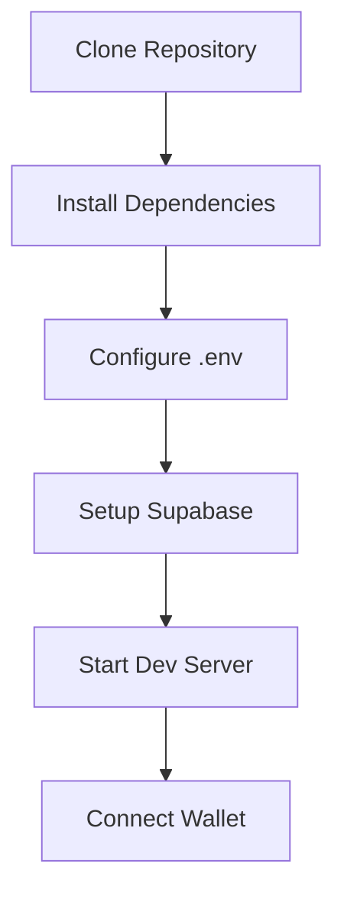

### Development Cycle

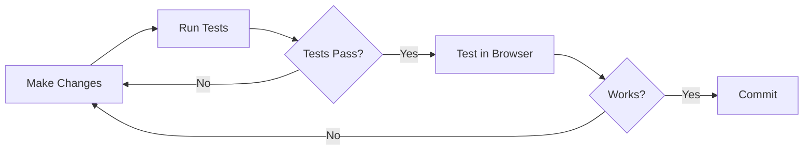

### Typical User Flow

1. Connect Sui wallet
2. Deposit USDC to house balance
3. Wait for round to start
4. Select betting target
5. Place bet
6. Watch price movement
7. Receive payout (if win)
8. Withdraw to wallet (optional)

## API Endpoints

### Balance Management

**GET /api/balance/[address]**
- Returns current house balance for address
- Response: `{ balance: number }`

**POST /api/balance/deposit**
- Records deposit from blockchain event
- Body: `{ address: string, amount: number, txHash: string }`

**POST /api/balance/withdraw**
- Records withdrawal from blockchain event
- Body: `{ address: string, amount: number, txHash: string }`

### Game Operations

**POST /api/balance/bet**
- Places a bet and deducts from house balance
- Body: `{ address: string, amount: number, target: number }`
- Response: `{ betId: string, newBalance: number }`

**POST /api/balance/win**
- Credits winnings to house balance
- Body: `{ address: string, amount: number, betId: string }`

**GET /api/balance/events**
- Event listener endpoint for blockchain events
- Processes DepositEvent and WithdrawalEvent

## Security Considerations

### Smart Contract Security

- Treasury uses Sui’s **Coin** standard for safe, composable token handling
- All deposits and withdrawals **emit events** for indexing and audit; event-driven sync keeps off-chain state correct
- Balance checks prevent overdraft; Move’s type system limits attack surface
- **Shared object** pattern allows permissionless deposit/withdraw while keeping a single source of truth

### Off-Chain Security

- Supabase Row Level Security (RLS) policies protect user data
- Balance updates use atomic transactions with audit logging
- Event listener validates all blockchain events before processing
- API endpoints validate user addresses and amounts

### Best Practices

- Never store private keys in code or environment variables
- Always verify transaction results before updating database
- Implement rate limiting on API endpoints
- Monitor audit logs for suspicious activity
- Regular reconciliation between blockchain and database state

## Troubleshooting

### Wallet Connection Issues

**Problem**: Wallet not connecting
- Ensure wallet extension is installed and unlocked
- Check that wallet is on correct network (testnet)
- Try refreshing the page

**Problem**: Wrong network
- Open wallet settings
- Switch to Sui testnet
- Refresh the application

### Transaction Failures

**Problem**: Insufficient gas
- Get testnet SUI from [faucet](https://discord.com/channels/916379725201563759/971488439931392130)
- Ensure at least 0.1 SUI for gas

**Problem**: Insufficient USDC
- Check USDC balance in wallet
- Deposit more USDC if needed

### Balance Sync Issues

**Problem**: Balance not updating after deposit
- Wait 5-10 seconds for event processing
- Check transaction on [Sui Explorer](https://suiexplorer.com)
- Verify event listener is running

**Problem**: Balance mismatch
- Run reconciliation script: `npm run reconcile`
- Check audit logs in Supabase

## Performance Optimization

### Frontend Optimization

- React components use memoization to prevent unnecessary re-renders
- Zustand store minimizes state updates
- Chart data is windowed to reduce memory usage
- API calls are debounced to reduce server load

### Backend Optimization

- Database indexes on user_address for fast lookups
- Stored procedures for atomic balance updates
- Connection pooling for Supabase client
- Event listener uses efficient polling strategy

### Blockchain Optimization

- Batch transaction building when possible
- Gas budget optimization for contract calls
- Event subscription instead of polling
- Shared object pattern for concurrent access

## Contributing

Contributions are welcome. Please follow these guidelines:

1. Fork the repository
2. Create a feature branch
3. Write tests for new functionality
4. Ensure all tests pass
5. Submit a pull request

## Roadmap & Continued Development

Overflow is built with ongoing development in mind:

- **Mainnet readiness** — Same architecture and contracts can target Sui mainnet with config and asset updates.
- **Composability** — Treasury and events can integrate with Sui PTBs (Programmable Transaction Blocks), DeepBook, and other DeFi building blocks.
- **Feature expansion** — Additional assets, round types, and on-chain settlement paths are natural next steps.
- **Ecosystem alignment** — Designed to evolve with Sui’s DeFi standards and tooling.

## Resources

### Sui Documentation & DeFi
- [Sui Documentation](https://docs.sui.io/)
- [Getting Started on Sui](https://docs.sui.io/guides/developer/getting-started)
- [Sui DeFi](https://www.sui.io/defi)
- [Building PTBs (Programmable Transaction Blocks)](https://docs.sui.io/guides/developer/sui-101/building-ptb)
- [DeepBook](https://docs.sui.io/standards/deepbook) · [DeepBook (GitHub)](https://github.com/MystenLabs/deepbookv3)
- [Sui Move Language](https://docs.sui.io/build/move)
- [Sui TypeScript SDK](https://sdk.mystenlabs.com/typescript)
- [Sui dApp Kit](https://sdk.mystenlabs.com/dapp-kit)

### Development Tools
- [Next.js Documentation](https://nextjs.org/docs)
- [Supabase Documentation](https://supabase.com/docs)
- [Tailwind CSS](https://tailwindcss.com/docs)
- [Zustand](https://github.com/pmndrs/zustand)
